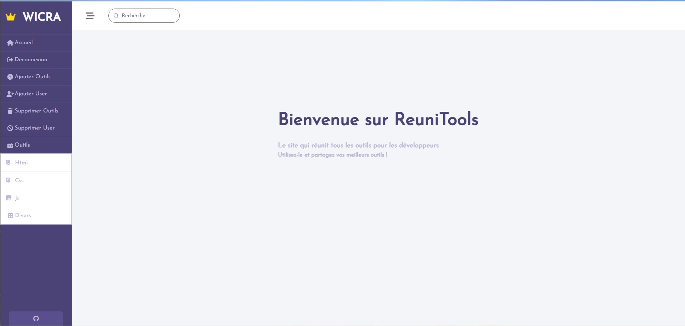
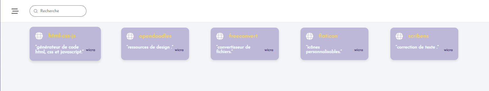

# Projet de Répertoire d'Outils de Développement

## Introduction

Ce projet a été réalisé dans le cadre de mes projets personnels, une idée que je nourrissais depuis longtemps. L'objectif principal est de créer un outil centralisé qui regroupe tous les outils de développement, qu'ils soient front ou back (sites Web, etc.), afin d'assister les débutants ainsi que les développeurs expérimentés.

## Fonctionnalités

Pour son fonctionnement, une connexion est requise. L'outil comprend des catégories préétablies contenant déjà des outils. De plus, chaque utilisateur a la possibilité d'ajouter ses propres outils, ce qui enrichit l'expérience collective.

## Objectif

L'objectif de ce projet est de rendre l'outil public, permettant ainsi à quiconque le souhaite d'accéder à une liste d'outils qu'ils peuvent utiliser localement.

En résumé, ce répertoire d'outils de développement vise à simplifier le processus de recherche et de découverte d'outils pour les développeurs, en offrant une plateforme centralisée et collaborative.

---

---

---

---

